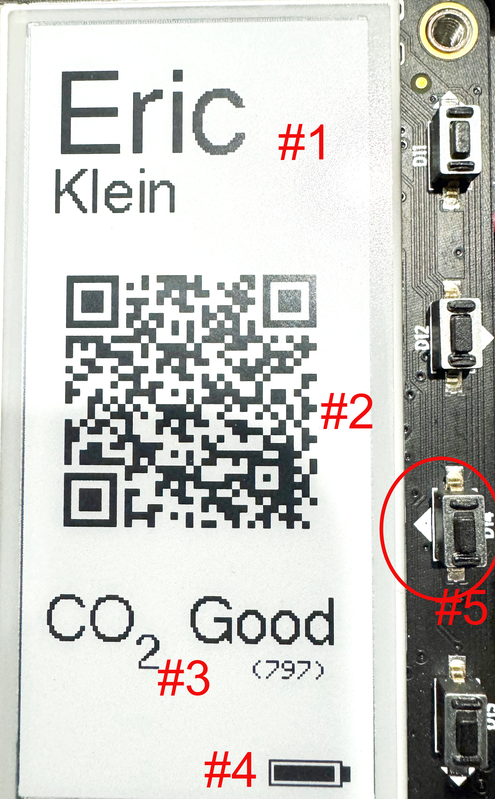

# badge
## Purpose
Badge is a fun way to display pertinent information to someone at an event. It is designed to replace the borrow paper "about" stickers or badges you get at events and spark a conversation.
## Associated projects
RCO2 has a number of sibling projects that share many common hardware and code attributes. Those are:
- [Air Quality](https://github.com/ericklein/air_quality) samples temperature, humidity, and if connected to the appropriate sensor, CO2 (carbon dioxide) levels. If AQ is configured with a screen, it can display this information. If AQ is connected to WiFi, it can log this information to a number of network endpoints, and it displays local outdoor weather and air quality information to compliment the indoor sensor information.
- [Powered Air Quality](https://github.com/ericklein/powered_air_quality) has all of the features of AQ along with the ability to sample local air particulate levels. This project uses an AC power source.
- [RCO2](https://github.com/ericklein/rco2) is a small, portable version of Air Quality that only samples and displays air quality levels.
## Features

- #1 - Badge wearer's name (set in config.h)
- #2 - QR Code to a URL (set in config.h)
- #3 - US standard CO2 label and value
- #4 - Battery level
- #5 - Wakes the ESP32 from deep sleep and refreshes the screen
## Target configuration
- See config.h for parameter configuration
## Bill of Materials (BOM)
### MCU
- [Adafruit MagTag](https://www.adafruit.com/product/4800)
	- core code is fairly portable amongst ESP32 boards
### WiFi
- [Adafruit MagTag](https://www.adafruit.com/product/4800)
	- any ESP32
###  Sensors
- [SCD40 temp/humidity/CO2 sensor](https://www.adafruit.com/product/5187)
	- SCD40 used in most of our build configurations
	- can use any SCD40 connected over i2c
### Battery
#### monitor
- [LC709203F battery voltage monitor](https://www.adafruit.com/product/4712)
#### battery
- standard LiPo battery with JST 2-PH cable
### Screen
- [Adafruit MagTag (EPD)](https://www.adafruit.com/product/4800)
### Buttons/Switches
- [Adafruit MagTag](https://www.adafruit.com/product/4800)
	- on/off switch
### LED (Neopixels)
- [Adafruit MagTag](https://www.adafruit.com/product/4800)
### Pinouts
- SCD40
    - Stemma QT cable between MCU board and SCD40 board
        - or connect 3.3v/5v, GND, SDA, SCL on both sides
- LC709203F
    - Stemma QT cable between MCU board and SCD40 board
        - or connect 3.3v/5v, GND, SDA, SCL on both sides
## Issues and Feature Requests
- [Github Issues](https://github.com/ericklein/badge/issues)
## .plan (big ticket items)
- [WiFI Manager](https://github.com/tzapu/WiFiManager) support
- OTA firmware update support
- Change hardware to non ESP32S2 MCU, allowing multiple GPIO pin wakeup, which enables button presses to cycle through multiple information screens
## Supporting Material
### Screen
- Good Display SPI; GDEW029T5D 2.9" b/w 128x296, UC8151D 
- https://cdn-learn.adafruit.com/downloads/pdf/adafruit-gfx-graphics-library.pdf
### Battery
- [LC709203F datasheet](readme/LC709203F_datasheet.pdf)
### Temperature and Humdity
- [Ideal indoor humidity](https://iaq.works/humidity/indoor-humidity-level-why-is-the-40-60-range-ideal/)
### CO2 (Carbon Dioxide)
#### Scales
We currently use the following scale:
- <800 - Good
- 800-999 - So-So
- 1000+ - Poor
##### Alternate ideas
- 
- 
- 
#### Impact on health
- [CO2 and indoor air quality](readme/CO2_and_indoor_air_quality.pdf)
#### Sensors
- [AHT20 info](https://learn.adafruit.com/adafruit-aht20)
- [CO2 sensor types](https://www.airgradient.com/blog/co2-sensors-photo-acoustic-vs-ndir-updated/)
- SCD40 sensor
	- [SCD40 datasheet](readme/Sensirion_CO2_Sensors_SCD4x_Datasheet.pdf)
### AQI
- [AQI Overview](readme/aqi_overview.md)
- [Open Weather Map Air Pollution API](https://openweathermap.org/api/air-pollution)
- [OSHA Air Quality](readme/OSHA_Indoor_Air_Quality.pdf)
- [Great site for air quality info](https://itsairborne.com/)
- [NYT on indoor gas stoves](https://www.nytimes.com/2023/01/29/climate/gas-stove-health.html)